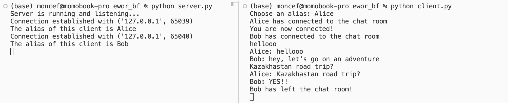

# Brainful Chat

A chat server where input/output operations are encoded and rendered using Brainfuck.


## Demo



---
## Setting up


### Installation
    git clone https://github.com/Mushrimpy/brainf_chat.git
    cd brainf_chat


### Running the App

1. Open a terminal and start the server:
    ```bash
    python server.py
    ```

2. Open additional terminals for each client you want to connect and run:
    ```bash
    python client.py
    ```

3. When prompted, enter an alias for the client.

---

## How It Works

The `TextBrainfuckConverter` takes a string and converts it into equivalent Brainfuck code, which is subsequently evaluated by the interpreter in `brainfuck/interpreter.py`. The network logic is handled using the python socket library.

#### 1. Generating Brainfuck for a Character
Each character is represented as an ASCII value. To optimize the code:
- A **loop** is used to increment the target cell by 10 (to efficiently reach higher ASCII values).
- Any remaining difference is handled by additional increments.

For example, converting the character `A` (ASCII 65):

```brainfuck
[-]>[-]<++++++[>++++++++++<-]>+++++.<
```

- `[-]>[-]<` Ensures the initial 2 pointers are set to 0.
- `++++++[>++++++++++<-]` Set cell [1] to 6 and create a loop to add 10 to cell [2] 6 times.
- `>+++++.<` Extra increment and output.

#### 2. Handling ASCII Value Differences Between Characters

For subsequent characters, the converter calculates the difference in ASCII values between the current and previous characters. This reduces the number of operations.


#### 3. Full String Conversion

The converter iterates through the input string, applying the above logic for each character:
- The first character uses `_char_to_bf`.
- Subsequent characters use `_delta_to_bf` to minimize operations.

---

## Future Work

- **Mega Brainfuck**  
  Create a Brainfuck extension  to natively handle socket programming and possibly even multithreading.  
  *Inspiration: [R. Singh's Brainfuck++](https://github.com/Gr3atWh173/brainfuckplusplus)*  

- **Multi-line Inputs**  
  Enhance the interpreter to allow for multi-line terminal input.


## References

- [1] [Brainfuck for Dummies](https://docs.google.com/document/d/1M51AYmDR1Q9UBsoTrGysvuzar2_Hx69Hz14tsQXWV6M/edit?tab=t.0)  
- [2] [Fabian Mastenbroek's Brainfuck Interpreter in C](https://github.com/fabianishere/brainfuck)
- [3] [Cydathria's Brainfuck Tutorial](http://cydathria.com/bf/Brainfuck.html)  

---
